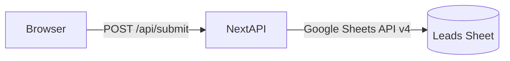

# deinvergleich.net – System Architecture

*Last updated: August 01, 2025*

---

## 1  Overview
**deinvergleich.net** is a responsive, single‑page web application that collects contact and project details from businesses looking for an external, DSGVO‑compliant data‑protection provider.  
Key goals:

* **Friction‑less lead capture** via a four‑step, progress‑driven form.  
* **Strict GDPR compliance** – minimal data retention, TLS everywhere, and explicit consent.  
* **Zero‑Ops backend** using Google Sheets as the primary persistence layer to keep infrastructure cost and complexity extremely low.  

---

## 2  Tech Stack

| Layer        | Technology                              | Rationale |
|--------------|-----------------------------------------|-----------|
| Frontend     | **Next.js 14** with the App Router, React Server Components, TypeScript | SEO‑friendly, file‑system routing, SSR/SSG, Vercel native deploy |
| Styling      | Tailwind CSS + Headless UI              | Utility‑first, accessible components, rapid prototyping |
| State        | React Context + `useReducer` + Zod      | Predictable, type‑safe client‑side state & validation |
| Backend      | **Next.js API Routes** (`/api/submit`)  | Co‑located serverless functions; scales automatically on Vercel |
| Persistence  | Google Sheets API v4 (Service Account)  | Simple CRUD, spreadsheet as lightweight CRM |
| AuthN/AuthZ  | None (public form); Google Service Account protected by env vars | Only the API route holds credentials |
| CI/CD        | GitHub Actions → Vercel Preview → Production | Automatic testing, linting & deployment |

---

## 3  Folder & File Structure

```
/
├─ architecture.md          # ← this document
├─ next.config.js
├─ package.json
├─ .env.example             # template for secrets (.env.local is git‑ignored)
├─ public/
│  └─ favicon.svg
├─ src/
│  ├─ pages/                # Pages Directory (if using Pages Router)
│  │  └─ _app.tsx
│  ├─ app/                  # App Router (recommended)
│  │  ├─ layout.tsx         # Root layout (includes Tailwind, metadata)
│  │  ├─ page.tsx           # Landing / multi‑step form
│  │  └─ api/
│  │     └─ submit/route.ts # Server Action or API Route (POST handler)
│  ├─ components/
│  │  ├─ MultiStepForm/
│  │  │  ├─ index.tsx
│  │  │  ├─ StepCompany.tsx
│  │  │  ├─ StepContact.tsx
│  │  │  ├─ StepProject.tsx
│  │  │  ├─ StepReview.tsx
│  │  │  └─ ProgressBar.tsx
│  │  └─ UI/
│  │     └─ TrustPoints.tsx
│  ├─ hooks/
│  │  └─ useMultiStepForm.ts
│  ├─ lib/
│  │  └─ googleSheets.ts    # Service wrapper: appendRow(), initClient()
│  ├─ schemas/
│  │  └─ formSchema.ts      # Zod validation / type inference
│  └─ styles/
│     └─ globals.css
├─ scripts/
│  └─ seed-dev-sheet.ts     # Optional: populate a dev sheet
├─ .github/
│  └─ workflows/
│     └─ ci.yml
└─ README.md
```

### What Each Part Does

| Path / File                          | Purpose |
|--------------------------------------|---------|
| **`src/app/page.tsx`**               | Renders the 4‑step form and orchestrates navigation between steps. |
| **`useMultiStepForm.ts`**            | React hook that encapsulates step index, field values, validation, and navigation helpers (`next()`, `prev()`). |
| **`MultiStepForm/*` components**     | Pure presentational components for each form step; receive props + callbacks; no state inside. |
| **`ProgressBar.tsx`**                | Calculates percent complete and renders “1 / 4” etc. |
| **`lib/googleSheets.ts`**            | Initializes Google Sheets client using service‑account creds, exposes `appendLeadRow(data)`; called only server‑side. |
| **`api/submit/route.ts`**            | POST endpoint; validates body against Zod schema → calls `appendLeadRow` → returns 200 JSON. |
| **`TrustPoints.tsx`**                | Six bullet points displayed beside / under the form to improve conversion. |
| **`.env.local`**                     | Holds `GOOGLE_SHEETS_ID`, `GOOGLE_SERVICE_ACCOUNT_EMAIL`, `GOOGLE_PRIVATE_KEY`. |
| **`ci.yml`**                         | Lint, type‑check, run unit tests, deploy preview on PR. |

---

## 4  State Management

* **Client‑side (Transient)**  
  * Form values are stored in a React Context backed by `useReducer`.  
  * Validation is performed on the fly with Zod schemas per step.  
  * After *Step Review* the reducer dispatches `SUBMIT`, which triggers a `fetch('/api/submit', …)`; on success the context is cleared to initial state.

* **Server‑side (Persistent)**  
  * The API route runs **only on the server** (Edge Function or Node runtime).  
  * It appends a single row to the Google Sheet:  

    | Unternehmen | PLZ | Land | Name | Telefonnummer | Emailadresse | Externer DSB vorhanden | Start | Unternehmensgröße | Timestamp |
    |-------------|-----|------|------|---------------|--------------|-----------------------|-------|-------------------|-----------|

  * No data is written anywhere else.  
  * A TTL Job (optional) can run in Google Apps Script to purge rows older than the “bearbeitet” date.

---

## 5  Services & Connectivity



1. **TLS 1.3** terminates at Vercel’s edge.  
2. API route authenticates to Google via JSON Web Token (service account).  
3. `appendLeadRow()` writes the data; Google returns the updated row number.  
4. API responds `{ status:"ok" }`; frontend shows “Danke!” page.

---

## 6  Security & GDPR Notes

* Data flows only through **encrypted channels** (HTTPS + Google APIs).  
* Service‑account keys are held **only** in Vercel’s encrypted secret store (`VC_`‑prefixed env vars).  
* PII retention limited to “bis die Anfrage bearbeitet ist” – implement manual or automated deletion.  
* Add a **Consent Checkbox** before Step Review referencing privacy policy and §6 Abs 1 lit b DSGVO.

---

## 7  Local Development

```bash
git clone git@github.com:your‑org/deinvergleich.git
cd deinvergleich
cp .env.example .env.local          # fill in Google creds & Sheet ID
pnpm install
pnpm dev
```

* For dev, the `seed-dev-sheet.ts` script can create dummy rows so the sheet exists.  
* Unit tests with Vitest, integration test the API route via Mock Service Worker.

---

## 8  Deployment Pipeline

1. **Push to `main`** → GitHub Actions runs ESLint, type‑check, unit tests.  
2. If green, action triggers **Vercel Deploy** — Preview URL.  
3. Merge → Auto‑promote to Production.  
4. Secrets (`GOOGLE_*`) are injected at build & runtime by Vercel.

---

## 9  Extensibility

* Replace Google Sheets with a proper database (PlanetScale/PostgreSQL) as volume grows.  
* Add authentication for a partner dashboard to view & export leads.  
* Webhooks / Zapier integration for CRM hand‑off (HubSpot, Pipedrive).  

---

> **Done!** You now have a complete, self‑contained architecture document for deinvergleich.net.
